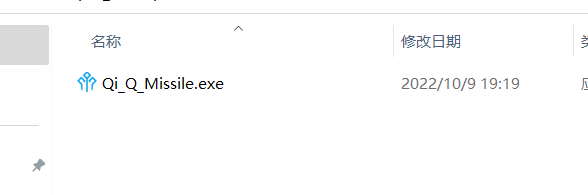

# Missile-system-23

RoboMaster 2023赛季及2022赛季飞镖系统电控代码。开发者为2020级崔学长。

## 开发环境

该工程使用keil在windows系统下进行开发。

## 硬件环境

本工程使用DJI开发板A进行开发。

## 工程开发说明

该工程代码包括上位机部分与下位机部分。

上位机工程用于辅助开发下位机工程而编写

下位机工程在使用时一定要先向开发板烧录驱动程序即[BootLoader](Missile-system-23\飞镖-RM22\BootLoader)，然后再烧录下位机飞镖工程代码[Missile_TypeA](Missile-system-23\飞镖-RM22\Missile_TypeA)。如果不按该步骤进行，可能程序无法在单片机中运行。
